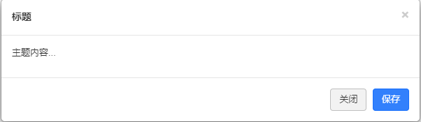

# 对话框组件效果说明 #
1. 组件介绍
一个对话框的组件，多种参数可修改
************************************
2. 使用方法
* 先在body中写一个class名为start的按钮
* 再引入css文件夹中的dialog.css，和js文件夹中的js文件
* 再var 一个对象，作为js中构造函数的参数集
### 参数描述
* cla:默认填wrap，为对话框的class名
* w为宽，默认为600px,h为高默认为200px
* bg为背景颜色，默认为灰色
* cont为对话框主要内容
* title为对话框标题
************************************
3. 联系方式
QQ:1455469827。
4. 成品展示
